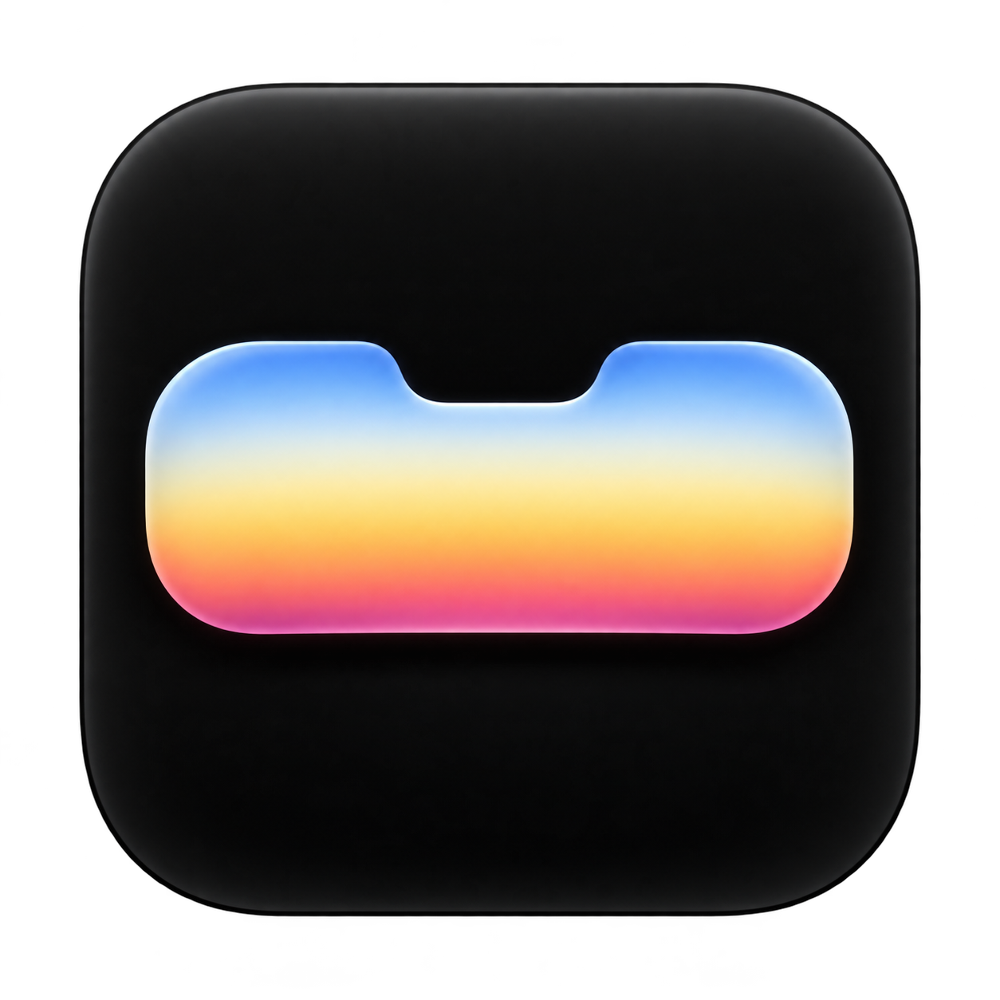
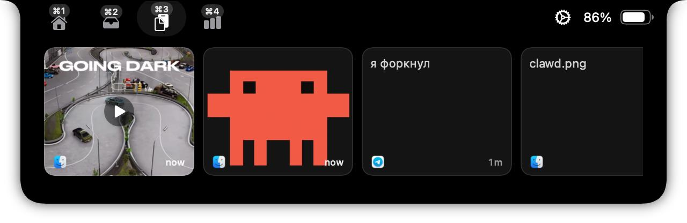
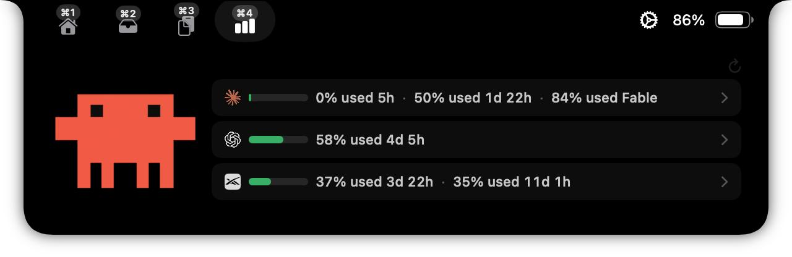
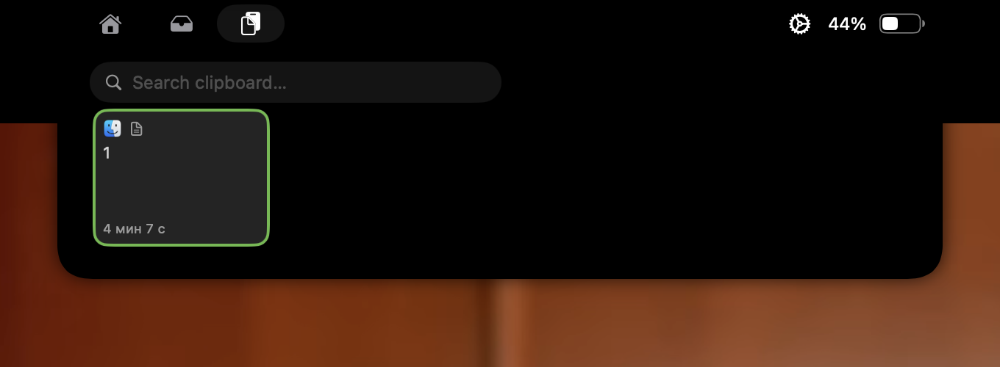

<p align="center">
  
</p>

<h1 align="center">Dynamite</h1>

<p align="center">
  <strong>Умная шторка для MacBook с выемкой</strong><br>
  Музыка, live activities, Clipboard, Shelf и usage AI-сервисов — в одном аккуратном слое над macOS.
</p>

<p align="center">
  <a href="https://github.com/poinncare/Dynamite/releases/latest"></a>
  <a href="https://github.com/poinncare/Dynamite/actions/workflows/ci.yml"></a>
  <a href="DynamiteApp/LICENSE"></a>
  <a href="https://github.com/poinncare/Dynamite/stargazers"></a>
</p>

<p align="center">
  <a href="https://github.com/poinncare/Dynamite/releases/latest">Скачать Dynamite</a> ·
  <a href="https://github.com/poinncare/Dynamite/issues">Сообщить о проблеме</a> ·
  <a href="DynamiteApp/CONTRIBUTING.md">Участвовать в разработке</a>
</p>

---

## Зачем Dynamite

Dynamite превращает выемку MacBook в компактный центр управления. Шторка появляется только тогда, когда нужна, не забирает рабочее пространство и остаётся доступной с клавиатуры.

## Возможности

| Пространство | Что делает |
| --- | --- |
| **Home** | Музыка, обложка, визуализатор и live activity текущего плеера |
| **Shelf** | Файловый трей с drag-and-drop, быстрым открытием и AirDrop/share |
| **Clipboard** | Локальная история скопированных текстов, изображений и файлов |
| **Usage** | Usage Claude, Codex и Grok с автообновлением и обнаружением CLI-агентов |

Кроме вкладок доступны календарь и напоминания, системные HUD для громкости/яркости, зеркало камеры, несколько дисплеев, жесты, кастомный акцентный цвет и гибкая настройка порядка пространств.

## Интерфейс

<p align="center">
  
  
</p>

<p align="center">
  
</p>

## Установка

### Готовое приложение

1. Откройте страницу [Releases](https://github.com/poinncare/Dynamite/releases/latest).
2. Скачайте DMG и перетащите `Dynamite.app` в `/Applications`.
3. Запустите приложение.

Сборка пока не подписана Apple Developer ID, поэтому macOS может показать предупреждение. Если приложение не открывается, выполните один раз:

```bash
xattr -dr com.apple.quarantine /Applications/Dynamite.app
```

### Homebrew

```bash
brew install --cask TheBoredTeam/dynamite/dynamite
```

## Быстрый старт

- Наведите курсор на выемку или нажмите её, чтобы открыть шторку.
- Удерживайте `⌘`, чтобы увидеть номера пространств.
- Переключайтесь через `⌘1`…`⌘N`; порядок и иконки задаются в **Settings → Spaces**.
- Настройте глобальные сочетания клавиш в **Settings → Shortcuts**.

### Основные сочетания клавиш

| Сочетание | Действие |
| --- | --- |
| `⌘1`…`⌘N` | Перейти к пространству в текущем порядке |
| `⌘⇧[` / `⌘⇧]` | Предыдущее / следующее пространство |
| `Esc` | Закрыть шторку или Quick Look |
| `⌘` на открытой шторке | Показать номера вкладок |
| `WASD` / `HJKL` / стрелки | Навигация по Clipboard |
| `Enter` | Вставить выбранный элемент Clipboard |
| `Space` | Открыть Quick Look выбранного элемента |

Полный список и переназначение сочетаний доступны в настройках.

## Настройки

Настройки разделены по назначению: **General**, **Appearance**, **Media**, **Calendar**, **HUDs**, **Battery**, **Shelf**, **Clipboard**, **Usage**, **Spaces**, **Shortcuts** и **Advanced**.

Изменения применяются сразу. В частности, акцентный цвет обновляет и саму шторку, и карточки Clipboard/Shelf, и панель настроек. История Clipboard хранится локально в `Application Support/Dynamite`.

## Обновления

Dynamite проверяет GitHub Appcast через Sparkle при запуске и предлагает новые версии из [Releases](https://github.com/poinncare/Dynamite/releases). Автоматические проверки и загрузку можно включить в **Settings → About → Software updates**.

## Требования

- macOS 14 Sonoma или новее
- Apple Silicon или Intel
- Для сборки: Xcode 16+ и macOS 15+

## Сборка из исходников

```bash
git clone https://github.com/poinncare/Dynamite.git
cd Dynamite/DynamiteApp

DEVELOPER_DIR=/Applications/Xcode.app/Contents/Developer \
xcodebuild -project Dynamite.xcodeproj \
  -scheme Dynamite \
  -configuration Debug \
  -destination 'platform=macOS' \
  build
```

Или откройте проект в Xcode:

```bash
open Dynamite.xcodeproj
```

## Приватность

Dynamite работает локально. История Clipboard сохраняется на этом Mac, а usage читается из локальных сессий CLI-провайдеров. Сетевые запросы выполняются только для получения данных usage и проверки обновлений.

## Участие в разработке

Баг-репорты, идеи и pull request приветствуются. Перед началом работы прочитайте [CONTRIBUTING.md](DynamiteApp/CONTRIBUTING.md). Архитектурные заметки и отчёты по проверкам находятся в [`docs/`](docs/).

## Благодарности

- [Maccy](https://github.com/p0deje/Maccy) — донор ядра истории Clipboard.
- [MediaRemoteAdapter](https://github.com/ungive/mediaremote-adapter) — источник Now Playing на новых версиях macOS.
- [NotchDrop](https://github.com/Lakr233/NotchDrop) — вдохновение для первой версии Shelf.

Полный список лицензий и атрибуций: [THIRD_PARTY_LICENSES](DynamiteApp/THIRD_PARTY_LICENSES).

<p align="center">
  Если Dynamite оказался полезен, поставьте ⭐ репозиторию.
</p>
